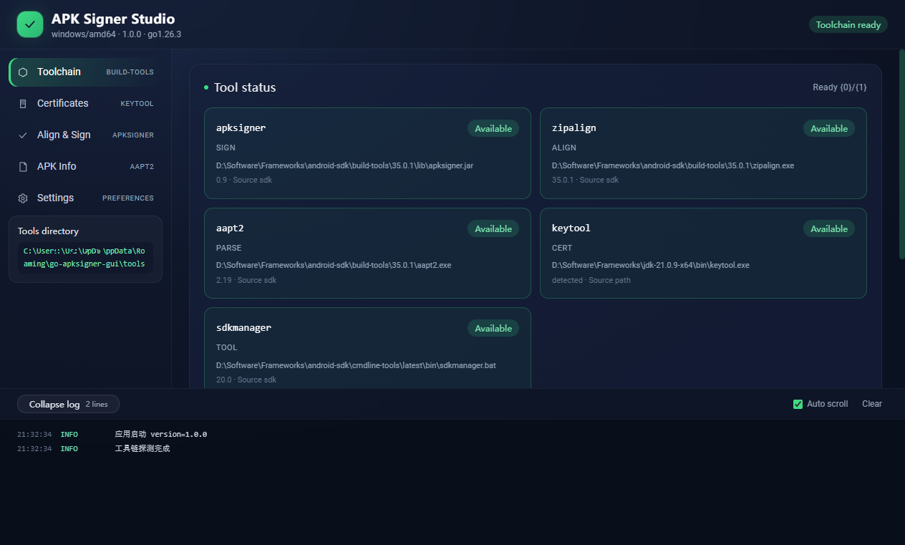
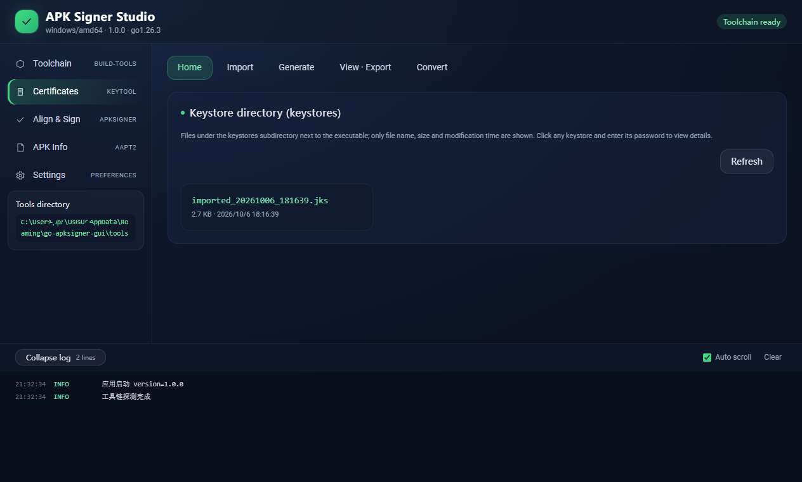
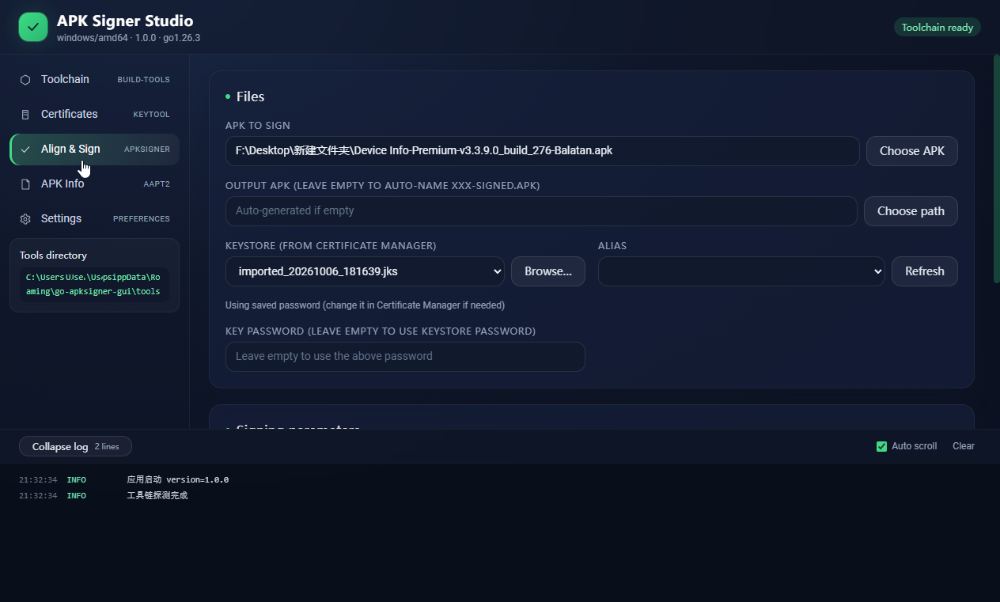
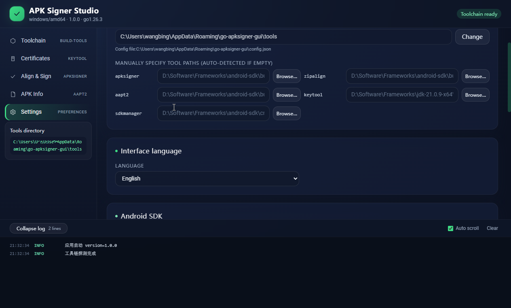

# APK Signer Studio（go-apksigner-gui）

[English Version](README.md)

用桌面 GUI 包装 Google `apksigner` 工具链，让使用者无需记忆命令行即可完成
「安装工具链 → 生成/查看证书 → 对齐 → 签名 → 验证」的完整流程。界面支持中英双语
（简体中文 / English，默认简体中文），主窗口单页多模块切换，所有长耗时操作均有实时进度与日志输出。

- 后端：Go + Wails v2（Go 后端 + 系统 WebView，单一 exe）
- 前端：Vue 3 + TypeScript + Vite + TailwindCSS + TDesign，包管理器 **pnpm**
- 目标平台：Windows（逻辑已做跨平台处理，Linux / macOS 亦可运行）

## 一、界面预览

| 工具链 | 证书 |
| --- | --- |
|  |  |

| 签名 | 设置 |
| --- | --- |
|  |  |

## 二、功能一览

| 模块 | 能力 |
| --- | --- |
| 工具链 | 自动探测 `apksigner` / `zipalign` / `aapt2` / `keytool` / `sdkmanager`；从仓库索引获取 build-tools 版本列表（不可达时回退 `app.yaml` 中的候选版本）；通过 `sdkmanager` 安装指定 build-tools 版本，带进度展示并支持取消；支持国内镜像源与 HTTP/HTTPS/SOCKS5 代理，并提供一键连通性测试 |
| 证书 | 五个标签页：**目录 / 导入 / 生成 / 查看 / 转换**。用 keytool 生成 JKS/PKCS12 密钥库（RSA 2048·4096 或 EC）；查看别名、有效期、所有者/颁发者、密钥算法与 MD5/SHA1/SHA256 指纹；导出 PEM 证书；PKCS12 ↔ JKS 互转；删除别名（二次确认）；导入外部密钥库到内置 `keystores` 目录；可选择记住密钥库密码（AES-256-GCM 加密保存） |
| 签名 | 选择 APK、密钥库与别名，设置 V1/V2/V3/V4 组合、输出路径、min/max SDK 限制；可选先 zipalign 后签名；可选先移除旧签名；运行时以流水线（去签 → 对齐 → 签名 → 验证）展示各步骤状态；签名后自动验证并回显证书摘要与告警 |
| APK 信息 | 读取包名、应用名、版本名/版本号、minSdk/targetSdk、文件大小与是否已签名；也可单独对 APK 执行验证。优先使用 aapt2，缺失时降级为内置纯 Go AXML 解析 |
| 设置 | 工具目录、逐个手工指定工具路径、Android SDK 根目录、界面语言（简体中文 / English）、镜像源与代理（带连通性测试）、默认签名方案、一键清理临时文件、重新探测工具链 |

工具探测顺序：用户指定路径 → 本地工具目录 → 已配置的 Android SDK 根目录 → `JAVA_HOME` 及常见安装目录（仅 keytool）→ 系统 `PATH`。
Windows 下 `apksigner` 优先以 `java -jar apksigner.jar` 方式调用，避免 `cmd /c` 二次解析含有 `"` `%` `&` `|` `(` `)` 等字符的密码而报「命令语法不正确」。

## 三、环境依赖

| 工具 | 用途 | 说明 |
| --- | --- | --- |
| Go | 编译后端 | `go.mod` 声明 `go 1.26`；Wails v2.16 |
| Node.js 18+ / pnpm | 构建前端 | Vite 6 / Vue 3.5 / TypeScript 5.7 |
| Wails CLI | 生成绑定 / 打包 | `go install github.com/wailsapp/wails/v2/cmd/wails@latest` |
| JDK（8+） | 提供 `keytool` 与 `java` | 证书生成依赖 keytool；通过 sdkmanager 安装 build-tools 还依赖 java |
| NSIS（可选） | 生成 Windows 安装包 | 未安装时 `build.ps1 -Package` 会降级为仅产出 exe |

> Windows 下若尚未安装 WebView2 运行时，首次运行 exe 时 Wails 会引导安装。

## 四、一键构建

`.\build.ps1` 串联：检查工具链（Go / pnpm / Wails CLI）→ `pnpm install` → `wails build`
（由 Wails 重新生成前后端绑定**并**构建前端，保证内嵌的 `frontend/dist` 与最新后端方法一致）
→ 复制 `app.yaml` 到 exe 同目录。

```powershell
# 普通构建（产出 build\bin\apk-signer-studio.exe）
.\build.ps1

# 跳过依赖安装（复用 node_modules）
.\build.ps1 -SkipInstall

# 跳过内置前端构建（追加 -s，复用已有 frontend/dist）
.\build.ps1 -SkipFrontend

# 生成 NSIS 安装包（需本机已装 makensis）
.\build.ps1 -Package

# 强制清理 build 目录后重新构建
.\build.ps1 -Clean
```

也可分步手动执行：

```powershell
cd frontend
pnpm install --allow-build esbuild
pnpm exec vite build        # 产出 frontend/dist
cd ..
wails build -s              # -s：跳过内置前端构建
```

> pnpm 11+ 默认禁用依赖构建脚本，esbuild 需要 postinstall 生成平台二进制，
> 因此安装时使用 `pnpm install --allow-build esbuild`（见 `frontend/pnpm-workspace.yaml`）。

仓库根目录的 `app.yaml` 会在构建时复制到 exe 同目录，并优先于内置默认值生效。无需重新编译即可调整：

| 配置段 | 内容 |
| --- | --- |
| `sdkmanager` | 各系统 Android 命令行工具（含 sdkmanager）下载地址与可选 SHA256 |
| `buildTools` | 默认版本与离线候选版本列表 |
| `mirrors` | 仓库索引镜像源（Google 官方、腾讯云、清华、东软、中科大） |
| `proxyTest` | 设置页「测试代理」使用的目标地址与超时 |
| `download` | 下载超时与重试次数 |

## 五、开发调试

```powershell
# 同时启动前端热更新与桌面窗口
wails dev
```

或直接仅调试前端（`frontend/dist` 不存在时后端无法独立编译）：

```powershell
cd frontend
pnpm exec vite   # 默认 http://localhost:5173
```

`frontend/wailsjs/` 由 `wails build` / `wails dev` 生成，请勿手动修改。

## 六、首次使用流程

1. 打开应用，进入「工具链」页：等待工具探测完成。若 `apksigner`/`zipalign`/`aapt2`
   缺失，先到「设置」页选择国内镜像源（如腾讯云），回到工具链页点击「刷新版本列表」
   并安装一个 build-tools 版本。首次安装会自动下载 Android 命令行工具，再执行
   `sdkmanager build-tools;<版本>`，进度区显示当前阶段并提供「取消下载」。
2. 进入「证书」页 → 生成：填写别名、通用名、组织信息与有效期，设置密钥库密码（不少于 6 位），
   选择保存路径（默认指向 exe 同级 `keystores` 目录），点击「生成密钥库」。
   可在「查看」标签中验证别名与指纹。
3. 进入「APK 信息」页：选择待签名 APK，确认包名/版本/是否已签名。
4. 进入「签名」页：选择 APK、密钥库与别名，填写密码，勾选 V1/V2/V3（默认），
   建议保留「签名前先 zipalign」。点击「开始签名」。完成后自动验证并显示证书摘要。
5. 底部日志抽屉实时输出各步骤进度，可清空、暂停自动滚动。

## 七、目录结构

```
go-apksigner-gui/
├── main.go / app.go        # Wails 入口与绑定层（暴露全部前端 API）
├── app.yaml                # 外部配置：镜像源 / 版本 / sdkmanager 地址 / 代理测试
├── wails.json / build.ps1  # 项目配置与一键构建脚本
├── internal/
│   ├── executor/  fileutil/  logger/   # 进程执行、ZIP/文件工具、日志
│   ├── i18n/      secure/              # 后端双语文案、AES-256-GCM 加解密
│   ├── config/    config/appcfg/       # 设置持久化 + app.yaml 加载
│   ├── tools/      # 工具探测 / 镜像与代理 / 版本索引 / 断点续传下载 / sdkmanager 安装
│   ├── certificate/# keytool 生成 / 输出解析 / 导出 / 转换 / 删除别名
│   ├── signer/     # 参数构建 / 移除旧签名 / zipalign / sign / verify 流水线
│   ├── apkinfo/    # aapt2 badging 解析 + AXML 兜底
│   └── dto/        # 前后端统一 JSON 契约
└── frontend/
    └── src/
        ├── api/        # Wails 绑定封装与事件订阅
        ├── i18n/       # 中英文文案目录
        ├── stores/     # 轻量全局状态
        └── views/      # ToolsView / CertView / SignView / ApkInfoView / SettingsView
```

## 八、测试

核心纯逻辑（不依赖外部进程）均有单元测试，稳定可重复执行：

```powershell
go test ./internal/...
```

覆盖 9 个测试文件：工具索引与版本解析、签名参数构建、keytool 中英文输出解析、证书信息提取、
aapt2/AXML 解析、ZIP 解压（ZIP Slip 防护、META-INF 过滤）、进程执行超时、日志脱敏、配置读写往返。

真实工具链（keytool / apksigner / zipalign / sdkmanager）相关逻辑建议手动冒烟：
生成测试密钥库 → 对齐 → 签名 → 验证。

## 九、常见问题

- **下载/安装 build-tools 很慢或失败**：在「设置」页切换镜像源（腾讯云/清华/东软/中科大），
  或配置 HTTP/HTTPS/SOCKS5 代理并用「测试代理」确认连通性；仓库索引不可达时版本列表会自动回退到
  `app.yaml` 中的候选版本。
- **sdkmanager 安装报错**：sdkmanager 本身依赖 Java，请确保 `java` 已在 `PATH` 中或已设置
  `JAVA_HOME`（提供 keytool 的 JDK 通常已满足）。命令行工具包从 `app.yaml` 配置的地址下载。
- **aapt2 缺失导致 APK 信息解析不全**：工具会自动降级为内置 AXML 解析，仅能回填基础字段，建议安装 build-tools。
- **配置文件在哪**：`os.UserConfigDir()/go-apksigner-gui/config.json`，权限 0600。
- **密钥库密码会落盘吗**：只有在显式勾选「记住密码」时才会保存，且使用 AES-256-GCM 加密，
  主密钥是随机生成的 32 字节密钥并存放在同一个 0600 配置文件中，仅在本机本用户下可用；可随时删除已保存的密码。
- **日志里出现 `******`**：密码在落盘与事件推送前已被脱敏。
- **`go:embed` 编译报错**：前端未构建时 `frontend/dist/index.html` 不存在，请先执行 `pnpm exec vite build` 或 `.\build.ps1`。
