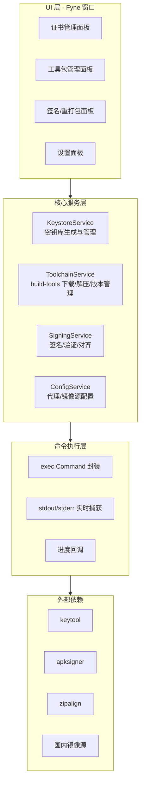
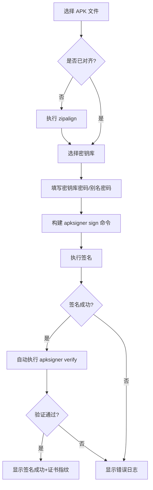
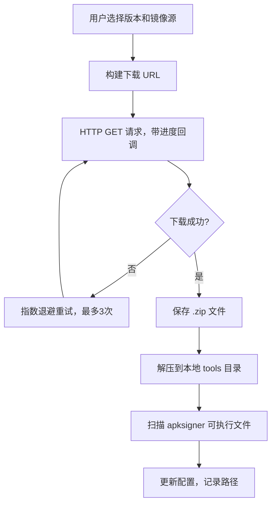

以下是一套完整的 Go 语言 GUI 设计方案，用于包装 Google 的 `apksigner` 工具。

---

## 一、主要功能模块



各模块职责如下：

**证书文件生成与管理 (KeystoreService)** ：调用 JDK 的 `keytool` 生成 JKS/PKCS12 密钥库，支持保存/加载证书配置、查看证书指纹、删除别名等操作。

**Google 原生工具包下载与管理 (ToolchainService)** ：从国内镜像源下载指定版本的 `build-tools`，解压到本地目录，识别可用的 `apksigner`、`zipalign` 等工具路径。

**APK 签名与再打包 (SigningService)** ：调用 `apksigner sign` 执行签名，`apksigner verify` 验证结果，`zipalign` 执行对齐，并支持在签名前解压 APK 进行内容替换后再重新打包。

**其他功能 (ConfigService)** ：代理设置、镜像源切换、日志输出、一键清理临时文件等。


## 二、主要流程

### 2.1 证书生成流程

```mermaid
sequenceDiagram
    participant U as 用户
    participant F as Fyne UI
    participant K as KeystoreService
    participant OS as 操作系统

    U->>F: 填写别名/密码/DName/有效期
    F->>K: GenerateKeystore(params)
    K->>K: 校验参数完整性
    K->>OS: exec.Command("keytool",
        "-genkeypair", "-v",
        "-keystore", path,
        "-alias", alias,
        "-keyalg", "RSA",
        "-keysize", "2048",
        "-validity", days,
        "-storepass", pass,
        "-keypass", keypass,
        "-dname", dname)
    OS-->>K: 返回 stdout/stderr
    K-->>F: 返回结果（成功/失败+日志）
    F-->>U: 弹窗显示结果
```

### 2.2 APK 签名流程



### 2.3 工具包下载流程




## 三、技术栈

| 层级 | 技术选型 | 说明 |
|---|---|---|
| **GUI 框架** | **Fyne v2** | 纯 Go 编写，跨平台，Material Design 风格，API 简洁 |
| **外部命令** | `os/exec` | 标准库，执行 `keytool`、`apksigner`、`zipalign` |
| **HTTP 下载** | `net/http` + `io.Copy` | 支持代理（`http.ProxyFromEnvironment`） |
| **进度反馈** | 自定义 `io.Writer` | 将下载字节数映射为 Fyne ProgressBar |
| **配置持久化** | JSON 文件 (`encoding/json`) | 保存工具路径、代理、默认密钥库路径 |
| **解压** | `archive/zip` | 标准库解压 build-tools zip |
| **日志** | 自定义 `Logger` 结构 | 同时写入 UI TextArea 和文件 |

**为什么选 Fyne？** Fyne 是 Go 生态中成熟度最高的跨平台 GUI 框架，纯 Go 实现无 CGO 依赖，编译产物为单一可执行文件，分发极为方便。其 `dialog.FileDialog` 可直接用于 APK/密钥库文件选择，`widget.ProgressBar` 用于下载进度展示。


## 四、部分实例代码

### 4.1 项目结构

```
apksigner-gui/
├── main.go
├── go.mod
├── internal/
│   ├── keystore/
│   │   └── service.go
│   ├── toolchain/
│   │   └── service.go
│   ├── signing/
│   │   └── service.go
│   ├── config/
│   │   └── config.go
│   └── executor/
│       └── exec.go
└── ui/
    ├── main_window.go
    ├── keystore_panel.go
    ├── toolchain_panel.go
    └── signing_panel.go
```

### 4.2 命令执行封装（internal/executor/exec.go）

```go
package executor

import (
	"bytes"
	"context"
	"fmt"
	"os/exec"
	"runtime"
	"strings"
	"time"
)

// Result 封装命令执行结果
type Result struct {
	Stdout   string
	Stderr   string
	ExitCode int
	Err      error
}

// Command 执行外部命令，带超时和实时输出回调
func Command(ctx context.Context, name string, args []string, timeout time.Duration, onOutput func(string)) (*Result, error) {
	ctx, cancel := context.WithTimeout(ctx, timeout)
	defer cancel()

	// Windows 下 apksigner 是 .bat 文件，需要特殊处理
	if runtime.GOOS == "windows" && strings.HasSuffix(name, "apksigner") {
		name = name + ".bat"
	}

	cmd := exec.CommandContext(ctx, name, args...)

	var stdoutBuf, stderrBuf bytes.Buffer
	cmd.Stdout = &stdoutBuf
	cmd.Stderr = &stderrBuf

	if err := cmd.Start(); err != nil {
		return &Result{Err: fmt.Errorf("启动命令失败: %w", err)}, err
	}

	// 等待完成（可扩展为带进度回调的版本）
	done := make(chan error, 1)
	go func() { done <- cmd.Wait() }()

	select {
	case <-ctx.Done():
		_ = cmd.Process.Kill()
		return &Result{Err: fmt.Errorf("命令执行超时")}, ctx.Err()
	case err := <-done:
		exitCode := 0
		if err != nil {
			if exitErr, ok := err.(*exec.ExitError); ok {
				exitCode = exitErr.ExitCode()
			}
		}
		result := &Result{
			Stdout:   stdoutBuf.String(),
			Stderr:   stderrBuf.String(),
			ExitCode: exitCode,
			Err:      err,
		}
		if onOutput != nil {
			onOutput(result.Stdout)
			onOutput(result.Stderr)
		}
		return result, err
	}
}
```

### 4.3 KeystoreService（internal/keystore/service.go）

```go
package keystore

import (
	"context"
	"fmt"
	"path/filepath"
	"time"

	"apksigner-gui/internal/executor"
)

type GenerateParams struct {
	KeystorePath string // 如 /home/user/release.jks
	Alias        string // 别名
	KeyAlg       string // 默认 RSA
	KeySize      int    // 默认 2048
	ValidityDays int    // 有效期天数
	StorePass    string // 密钥库密码
	KeyPass      string // 密钥密码
	DName        string // 如 "CN=MyApp, OU=Dev, O=MyOrg, L=City, ST=State, C=CN"
}

type Service struct {
	KeytoolPath string // keytool 可执行文件路径（可自动探测）
}

// GenerateKeystore 调用 keytool 生成密钥库
func (s *Service) GenerateKeystore(ctx context.Context, p GenerateParams) (*executor.Result, error) {
	if p.KeyAlg == "" {
		p.KeyAlg = "RSA"
	}
	if p.KeySize == 0 {
		p.KeySize = 2048
	}
	if p.ValidityDays == 0 {
		p.ValidityDays = 365 * 25 // 约25年
	}

	args := []string{
		"-genkeypair",
		"-v",
		"-keystore", p.KeystorePath,
		"-alias", p.Alias,
		"-keyalg", p.KeyAlg,
		"-keysize", fmt.Sprintf("%d", p.KeySize),
		"-validity", fmt.Sprintf("%d", p.ValidityDays),
		"-storepass", p.StorePass,
		"-keypass", p.KeyPass,
		"-dname", p.DName,
		"-storetype", "PKCS12", // 推荐 PKCS12，兼容性更好
	}

	return executor.Command(ctx, s.KeytoolPath, args, 60*time.Second, nil)
}

// ListAliases 列出密钥库中所有别名
func (s *Service) ListAliases(ctx context.Context, keystorePath, storePass string) (*executor.Result, error) {
	args := []string{
		"-list",
		"-keystore", keystorePath,
		"-storepass", storePass,
		"-v",
	}
	return executor.Command(ctx, s.KeytoolPath, args, 30*time.Second, nil)
}

// GetCertFingerprint 获取证书 SHA-256 指纹
func (s *Service) GetCertFingerprint(ctx context.Context, keystorePath, alias, storePass string) (*executor.Result, error) {
	args := []string{
		"-list",
		"-keystore", keystorePath,
		"-alias", alias,
		"-storepass", storePass,
		"-v",
	}
	return executor.Command(ctx, s.KeytoolPath, args, 30*time.Second, nil)
}

// DetectKeytool 自动探测 keytool 路径
func DetectKeytool() string {
	// 常见路径：JAVA_HOME/bin/keytool, /usr/bin/keytool, C:\Program Files\Java\...\keytool.exe
	// 简化实现：使用 exec.LookPath
	path, err := exec.LookPath("keytool")
	if err != nil {
		return ""
	}
	return path
}

// 需要 import "os/exec"
```

### 4.4 ToolchainService（internal/toolchain/service.go）

```go
package toolchain

import (
	"archive/zip"
	"context"
	"fmt"
	"io"
	"net/http"
	"os"
	"path/filepath"
	"strings"
	"time"
)

// Mirror 镜像源配置
type Mirror struct {
	Name       string
	BaseURL    string
	APIPattern string // 如 "build-tools_r%s-linux.zip"
}

var Mirrors = []Mirror{
	{Name: "阿里云", BaseURL: "https://mirrors.aliyun.com/android-sdk/", APIPattern: "build-tools_r%s-linux.zip"},
	{Name: "中科大", BaseURL: "https://mirrors.ustc.edu.cn/android/repository/", APIPattern: "build-tools_r%s-linux.zip"},
	{Name: "清华", BaseURL: "https://mirrors.tuna.tsinghua.edu.cn/android/repository/", APIPattern: "build-tools_r%s-linux.zip"},
}

type Service struct {
	ToolsDir string // 本地 tools 根目录
	client   *http.Client
}

func NewService(toolsDir string) *Service {
	return &Service{
		ToolsDir: toolsDir,
		client: &http.Client{
			Timeout: 30 * time.Minute,
			// 自动读取 HTTP_PROXY/HTTPS_PROXY 环境变量
		},
	}
}

// DownloadBuildTools 下载指定版本的 build-tools
// version 如 "34.0.0"
func (s *Service) DownloadBuildTools(ctx context.Context, mirror Mirror, version string, onProgress func(downloaded, total int64)) (string, error) {
	fileName := fmt.Sprintf("build-tools_r%s-linux.zip", version)
	url := mirror.BaseURL + fileName
	destPath := filepath.Join(s.ToolsDir, fileName)

	// 创建目标文件
	out, err := os.Create(destPath)
	if err != nil {
		return "", fmt.Errorf("创建文件失败: %w", err)
	}
	defer out.Close()

	// 带重试的下载
	var resp *http.Response
	for attempt := 0; attempt < 3; attempt++ {
		req, _ := http.NewRequestWithContext(ctx, "GET", url, nil)
		resp, err = s.client.Do(req)
		if err == nil && resp.StatusCode == http.StatusOK {
			break
		}
		if resp != nil {
			resp.Body.Close()
		}
		time.Sleep(time.Duration(1<<uint(attempt)) * time.Second) // 指数退避
	}
	if err != nil || resp.StatusCode != http.StatusOK {
		return "", fmt.Errorf("下载失败: %v", err)
	}
	defer resp.Body.Close()

	total := resp.ContentLength
	var downloaded int64

	// 包装 io.Reader 实现进度回调
	reader := &progressReader{
		reader: resp.Body,
		total:  total,
		onProgress: func(n int64) {
			downloaded += n
			if onProgress != nil {
				onProgress(downloaded, total)
			}
		},
	}

	if _, err := io.Copy(out, reader); err != nil {
		return "", fmt.Errorf("写入文件失败: %w", err)
	}

	return destPath, nil
}

// ExtractBuildTools 解压 build-tools zip
func (s *Service) ExtractBuildTools(zipPath, version string) (string, error) {
	destDir := filepath.Join(s.ToolsDir, "build-tools", version)
	if err := os.MkdirAll(destDir, 0755); err != nil {
		return "", err
	}

	r, err := zip.OpenReader(zipPath)
	if err != nil {
		return "", fmt.Errorf("打开 zip 失败: %w", err)
	}
	defer r.Close()

	for _, f := range r.File {
		fpath := filepath.Join(destDir, f.Name)

		// 安全校验：防止 zip slip
		if !strings.HasPrefix(fpath, filepath.Clean(destDir)+string(os.PathSeparator)) {
			continue
		}

		if f.FileInfo().IsDir() {
			os.MkdirAll(fpath, f.Mode())
			continue
		}

		os.MkdirAll(filepath.Dir(fpath), 0755)
		outFile, err := os.Create(fpath)
		if err != nil {
			return "", err
		}
		rc, err := f.Open()
		if err != nil {
			outFile.Close()
			return "", err
		}
		io.Copy(outFile, rc)
		rc.Close()
		outFile.Close()
	}

	// 探测 apksigner 路径
	apksignerPath := filepath.Join(destDir, "apksigner")
	if _, err := os.Stat(apksignerPath); err == nil {
		return apksignerPath, nil
	}
	// 可能在子目录中
	entries, _ := os.ReadDir(destDir)
	for _, e := range entries {
		if e.IsDir() {
			candidate := filepath.Join(destDir, e.Name(), "apksigner")
			if _, err := os.Stat(candidate); err == nil {
				return candidate, nil
			}
		}
	}
	return "", fmt.Errorf("未找到 apksigner")
}

// progressReader 包装 io.Reader 以报告进度
type progressReader struct {
	reader     io.Reader
	total      int64
	onProgress func(n int64)
}

func (p *progressReader) Read(buf []byte) (int, error) {
	n, err := p.reader.Read(buf)
	if n > 0 && p.onProgress != nil {
		p.onProgress(int64(n))
	}
	return n, err
}
```

### 4.5 SigningService（internal/signing/service.go）

```go
package signing

import (
	"context"
	"fmt"
	"time"

	"apksigner-gui/internal/executor"
)

type SignParams struct {
	ApkPath       string
	KeystorePath  string
	Alias         string
	StorePass     string
	KeyPass       string
	OutputPath    string // 为空则原地签名
	MinSDK        int    // 0 表示不指定
	MaxSDK        int    // 0 表示不指定
	V1Enabled     *bool  // nil 表示默认
	V2Enabled     *bool
	V3Enabled     *bool
	ZipalignFirst bool // 签名前是否先对齐
}

type Service struct {
	ApksignerPath string
	ZipalignPath  string
}

// Sign 执行 APK 签名
func (s *Service) Sign(ctx context.Context, p SignParams) (*executor.Result, error) {
	// 1. 可选：先 zipalign
	if p.ZipalignFirst && s.ZipalignPath != "" {
		alignedPath := p.ApkPath + ".aligned"
		_, err := s.Zipalign(ctx, p.ApkPath, alignedPath)
		if err != nil {
			return nil, fmt.Errorf("zipalign 失败: %w", err)
		}
		p.ApkPath = alignedPath
	}

	// 2. 构建 apksigner 参数
	args := []string{"sign"}
	args = append(args, "--ks", p.KeystorePath)
	if p.Alias != "" {
		args = append(args, "--ks-key-alias", p.Alias)
	}
	if p.StorePass != "" {
		args = append(args, "--ks-pass", "pass:"+p.StorePass)
	}
	if p.KeyPass != "" {
		args = append(args, "--key-pass", "pass:"+p.KeyPass)
	}
	if p.OutputPath != "" {
		args = append(args, "--out", p.OutputPath)
	}
	if p.MinSDK > 0 {
		args = append(args, "--min-sdk-version", fmt.Sprintf("%d", p.MinSDK))
	}
	if p.MaxSDK > 0 {
		args = append(args, "--max-sdk-version", fmt.Sprintf("%d", p.MaxSDK))
	}
	if p.V1Enabled != nil {
		args = append(args, "--v1-signing-enabled", fmt.Sprintf("%t", *p.V1Enabled))
	}
	if p.V2Enabled != nil {
		args = append(args, "--v2-signing-enabled", fmt.Sprintf("%t", *p.V2Enabled))
	}
	args = append(args, p.ApkPath)

	// 3. 执行签名
	return executor.Command(ctx, s.ApksignerPath, args, 5*time.Minute, nil)
}

// Verify 验证 APK 签名
func (s *Service) Verify(ctx context.Context, apkPath string, printCerts bool) (*executor.Result, error) {
	args := []string{"verify", "--verbose"}
	if printCerts {
		args = append(args, "--print-certs")
	}
	args = append(args, apkPath)
	return executor.Command(ctx, s.ApksignerPath, args, 60*time.Second, nil)
}

// Zipalign 执行 APK 对齐
func (s *Service) Zipalign(ctx context.Context, input, output string) (*executor.Result, error) {
	args := []string{"-f", "-v", "4", input, output}
	return executor.Command(ctx, s.ZipalignPath, args, 2*time.Minute, nil)
}
```

### 4.6 Fyne UI —— 主窗口与签名面板（ui/signing_panel.go 节选）

```go
package ui

import (
	"context"
	"fmt"
	"time"

	"fyne.io/fyne/v2"
	"fyne.io/fyne/v2/container"
	"fyne.io/fyne/v2/dialog"
	"fyne.io/fyne/v2/widget"

	"apksigner-gui/internal/signing"
)

type SigningPanel struct {
	signSvc *signing.Service
	window  fyne.Window

	apkPathEntry      *widget.Entry
	keystoreEntry     *widget.Entry
	aliasEntry        *widget.Entry
	storePassEntry    *widget.Entry
	keyPassEntry      *widget.Entry
	outputEntry       *widget.Entry
	minSDKEntry       *widget.Entry
	maxSDKEntry       *widget.Entry
	zipalignCheck     *widget.Check
	logArea           *widget.Entry
	statusLabel       *widget.Label
}

func NewSigningPanel(signSvc *signing.Service, win fyne.Window) *SigningPanel {
	p := &SigningPanel{signSvc: signSvc, window: win}
	p.buildUI()
	return p
}

func (p *SigningPanel) buildUI() {
	p.apkPathEntry = widget.NewEntry()
	p.apkPathEntry.SetPlaceHolder("选择待签名的 APK 文件")

	chooseApkBtn := widget.NewButton("选择 APK", func() {
		dialog.ShowFileOpen(func(reader fyne.URIReadCloser, err error) {
			if err != nil || reader == nil {
				return
			}
			defer reader.Close()
			p.apkPathEntry.SetText(reader.URI().Path())
		}, p.window)
	})

	p.keystoreEntry = widget.NewEntry()
	p.keystoreEntry.SetPlaceHolder("选择 .jks/.keystore 文件")

	chooseKsBtn := widget.NewButton("选择密钥库", func() {
		dialog.ShowFileOpen(func(reader fyne.URIReadCloser, err error) {
			if err != nil || reader == nil {
				return
			}
			defer reader.Close()
			p.keystoreEntry.SetText(reader.URI().Path())
		}, p.window)
	})

	p.aliasEntry = widget.NewEntry()
	p.aliasEntry.SetPlaceHolder("密钥别名")

	p.storePassEntry = widget.NewPasswordEntry()
	p.storePassEntry.SetPlaceHolder("密钥库密码")

	p.keyPassEntry = widget.NewPasswordEntry()
	p.keyPassEntry.SetPlaceHolder("密钥密码（可与密钥库密码相同）")

	p.outputEntry = widget.NewEntry()
	p.outputEntry.SetPlaceHolder("输出 APK 路径（留空则原地签名）")

	p.minSDKEntry = widget.NewEntry()
	p.minSDKEntry.SetPlaceHolder("最低 SDK（留空自动）")

	p.maxSDKEntry = widget.NewEntry()
	p.maxSDKEntry.SetPlaceHolder("最高 SDK（留空自动）")

	p.zipalignCheck = widget.NewCheck("签名前先执行 zipalign 对齐", nil)

	p.logArea = widget.NewMultiLineEntry()
	p.logArea.SetPlaceHolder("签名日志将显示在此处...")
	p.logArea.Disable()

	p.statusLabel = widget.NewLabel("就绪")

	signBtn := widget.NewButton("开始签名", p.doSign)
	verifyBtn := widget.NewButton("验证签名", p.doVerify)

	form := container.NewVBox(
		container.NewBorder(nil, nil, nil, chooseApkBtn, p.apkPathEntry),
		container.NewBorder(nil, nil, nil, chooseKsBtn, p.keystoreEntry),
		p.aliasEntry,
		p.storePassEntry,
		p.keyPassEntry,
		p.outputEntry,
		container.NewGridWithColumns(2, p.minSDKEntry, p.maxSDKEntry),
		p.zipalignCheck,
		container.NewHBox(signBtn, verifyBtn),
		p.statusLabel,
		container.NewScroll(p.logArea),
	)
	p.Content = form
}

func (p *SigningPanel) doSign() {
	params := signing.SignParams{
		ApkPath:       p.apkPathEntry.Text,
		KeystorePath:  p.keystoreEntry.Text,
		Alias:         p.aliasEntry.Text,
		StorePass:     p.storePassEntry.Text,
		KeyPass:       p.keyPassEntry.Text,
		OutputPath:    p.outputEntry.Text,
		ZipalignFirst: p.zipalignCheck.Checked,
	}

	if params.ApkPath == "" || params.KeystorePath == "" {
		dialog.ShowError(fmt.Errorf("请选择 APK 和密钥库文件"), p.window)
		return
	}

	p.statusLabel.SetText("签名中...")
	p.logArea.SetText("")

	go func() {
		ctx, cancel := context.WithTimeout(context.Background(), 5*time.Minute)
		defer cancel()

		result, err := p.signSvc.Sign(ctx, params)
		if err != nil {
			p.logArea.SetText(fmt.Sprintf("签名失败:\n%s\n%s", result.Stderr, err))
			p.statusLabel.SetText("签名失败")
			return
		}
		p.logArea.SetText(fmt.Sprintf("签名成功!\n%s", result.Stdout))
		p.statusLabel.SetText("签名完成")
	}()
}

func (p *SigningPanel) doVerify() {
	apkPath := p.apkPathEntry.Text
	if apkPath == "" {
		dialog.ShowError(fmt.Errorf("请先选择 APK"), p.window)
		return
	}

	go func() {
		ctx, cancel := context.WithTimeout(context.Background(), time.Minute)
		defer cancel()
		result, err := p.signSvc.Verify(ctx, apkPath, true)
		if err != nil {
			p.logArea.SetText(fmt.Sprintf("验证失败:\n%s", result.Stderr))
			return
		}
		p.logArea.SetText(fmt.Sprintf("验证结果:\n%s", result.Stdout))
	}()
}
```

### 4.7 主入口（main.go）

```go
package main

import (
	"os"
	"path/filepath"

	"fyne.io/fyne/v2"
	"fyne.io/fyne/v2/app"
	"fyne.io/fyne/v2/container"

	"apksigner-gui/internal/config"
	"apksigner-gui/internal/keystore"
	"apksigner-gui/internal/signing"
	"apksigner-gui/internal/toolchain"
	"apksigner-gui/ui"
)

func main() {
	a := app.NewWithID("com.example.apksigner-gui")
	a.Settings().SetTheme(nil) // 使用默认主题

	win := a.NewWindow("APK Signer GUI")
	win.Resize(fyne.NewSize(900, 700))

	// 初始化服务
	cfg := config.Load()
	toolsDir := cfg.ToolsDir
	if toolsDir == "" {
		home, _ := os.UserHomeDir()
		toolsDir = filepath.Join(home, ".apksigner-gui", "tools")
	}

	tcSvc := toolchain.NewService(toolsDir)
	ksSvc := &keystore.Service{KeytoolPath: keystore.DetectKeytool()}
	signSvc := &signing.Service{
		ApksignerPath: cfg.ApksignerPath,
		ZipalignPath:  cfg.ZipalignPath,
	}

	// 构建 UI
	ksPanel := ui.NewKeystorePanel(ksSvc, win)
	tcPanel := ui.NewToolchainPanel(tcSvc, win, cfg)
	signPanel := ui.NewSigningPanel(signSvc, win)

	tabs := container.NewAppTabs(
		container.NewTabItem("证书管理", ksPanel.Content),
		container.NewTabItem("工具包", tcPanel.Content),
		container.NewTabItem("APK 签名", signPanel.Content),
	)

	win.SetContent(tabs)
	win.ShowAndRun()
}
```

### 4.8 配置持久化（internal/config/config.go）

```go
package config

import (
	"encoding/json"
	"os"
	"path/filepath"
)

type Config struct {
	ToolsDir       string `json:"tools_dir"`
	ApksignerPath  string `json:"apksigner_path"`
	ZipalignPath   string `json:"zipalign_path"`
	KeytoolPath    string `json:"keytool_path"`
	MirrorIndex    int    `json:"mirror_index"`
	HTTPProxy      string `json:"http_proxy"`
	LastKeystore   string `json:"last_keystore"`
	DefaultAlias   string `json:"default_alias"`
}

func configPath() string {
	home, _ := os.UserHomeDir()
	return filepath.Join(home, ".apksigner-gui", "config.json")
}

func Load() *Config {
	data, err := os.ReadFile(configPath())
	if err != nil {
		return &Config{}
	}
	var c Config
	if json.Unmarshal(data, &c) != nil {
		return &Config{}
	}
	return &c
}

func (c *Config) Save() error {
	dir := filepath.Dir(configPath())
	os.MkdirAll(dir, 0755)
	data, _ := json.MarshalIndent(c, "", "  ")
	return os.WriteFile(configPath(), data, 0644)
}
```


## 五、如何测试和运行

### 5.1 环境准备

```bash
# 1. 安装 Go 1.21+
# 2. 安装 JDK（提供 keytool）
java -version   # 确认 JDK 已安装
which keytool   # 确认 keytool 在 PATH 中

# 3. 安装 Fyne CLI 工具
go install fyne.io/tools/cmd/fyne@latest
```

### 5.2 运行

```bash
cd apksigner-gui
go mod tidy
go run .
```

首次启动后，进入 **工具包面板**，选择国内镜像源（推荐阿里云或中科大），下载指定版本的 `build-tools`。下载完成后工具会自动解压并记录 `apksigner` 路径。

### 5.3 测试签名流程

**步骤 1：生成测试密钥库**

在证书管理面板填写：

| 字段 | 测试值 |
|---|---|
| 密钥库路径 | `/tmp/test-release.jks` |
| 别名 | `testkey` |
| 密钥算法 | `RSA` |
| 密钥大小 | `2048` |
| 有效期 | `365` |
| 密钥库密码 | `123456` |
| 密钥密码 | `123456` |
| DName | `CN=Test, OU=Dev, O=TestOrg, L=Beijing, ST=Beijing, C=CN` |

点击"生成密钥库"。等价命令为：

```bash
keytool -genkeypair -v -keystore /tmp/test-release.jks -alias testkey \
  -keyalg RSA -keysize 2048 -validity 365 \
  -storepass 123456 -keypass 123456 \
  -dname "CN=Test, OU=Dev, O=TestOrg, L=Beijing, ST=Beijing, C=CN" \
  -storetype PKCS12
```

**步骤 2：准备测试 APK**

使用任意已签名的 APK，或从 Android SDK 示例中获取。

**步骤 3：执行签名**

在签名面板中选择 APK 和密钥库，点击"开始签名"。等价命令为：

```bash
apksigner sign --ks /tmp/test-release.jks --ks-key-alias testkey \
  --ks-pass pass:123456 --key-pass pass:123456 \
  --out /tmp/signed.apk /tmp/unsigned.apk
```

**步骤 4：验证签名**

点击"验证签名"。等价命令为：

```bash
apksigner verify --verbose --print-certs /tmp/signed.apk
```

预期输出包含 `Verified using v1 scheme` 或 `Verified using v2 scheme` 等标识。

### 5.4 单元测试示例

```go
// internal/signing/service_test.go
func TestBuildSignArgs(t *testing.T) {
    // 验证参数构建逻辑
}
```

```bash
go test ./... -v
```

### 5.5 打包分发

```bash
# Windows
fyne package -os windows -icon icon.png

# Linux
fyne package -os linux -icon icon.png

# macOS
fyne package -os darwin -icon icon.png
```

生成的安装包位于当前目录，可直接分发给用户。Windows 下建议额外确认 `apksigner.bat` 的执行路径处理——代码中已对 `.bat` 后缀做了兼容。


### 关键注意事项

1. **跨平台路径**：Windows 下 `apksigner` 是 `.bat` 文件，`executor.Command` 中已做自动补全处理。
2. **代理支持**：`http.Client` 默认读取系统 `HTTP_PROXY`/`HTTPS_PROXY` 环境变量，用户也可在设置面板中手动指定。
3. **密码安全**：密码输入框使用 `widget.PasswordEntry`，但配置文件中以明文保存密钥库路径等信息时，**密码不应持久化**。
4. **超时处理**：签名大 APK 可能需要较长时间，`context.WithTimeout` 设为 5 分钟较为合理。
5. **并发 UI 更新**：Fyne 要求在 goroutine 中通过 `widget` 的 setter 更新界面时是线程安全的，Fyne v2 的 widget 已内置锁机制，但大量更新时建议使用 `fyne.Do` 或 `canvas.Refresh`。